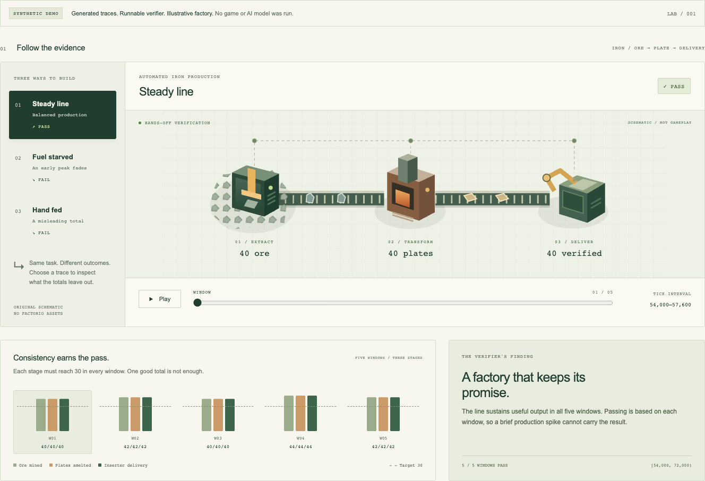

# Factorio-Bench

### Build a factory. Prove it works.

An environment design for evaluating AI agents on factory construction, production, logistics, and long-horizon planning. The central question: **does the factory keep working after the agent stops?**

**Now:** a runnable synthetic evidence lab, three reproducible examples, and the native benchmark design. **Next:** integration with real Factorio. No game backend, simulator, or AI benchmark results are included yet.

[Run the demo](#try-the-evidence-lab) · [Explore the examples](docs/examples.md) · [Read the design](docs/factorio-bench-design.md) · [Implementation roadmap](docs/factorio-bench-design.md#implementation-milestones-and-acceptance)



*Actual browser capture of the included viewer. Original schematic and synthetic events, not Factorio gameplay. [Mobile view](docs/assets/showcase-mobile.png) · [Image provenance](docs/assets/README.md)*

## Try the evidence lab

With Python 3.9 or later and Make, no packages or credentials are needed:

```sh
git clone https://github.com/cytonomy/factorio-bench.git
cd factorio-bench
make demo
```

Open **http://127.0.0.1:8765**. Select a scenario, play or scrub the five verification windows, and open the event ledger. The server listens only on your computer; Ctrl+C stops it.

Run `make examples` for the command-line version, or `python3 scripts/run_examples.py` if Make is unavailable. See [the example guide](docs/examples.md) for setup, scoring rules, and limitations.

| Synthetic example | Outcome | What the evidence reveals |
| --- | --- | --- |
| **Steady line** | Pass · 5/5 windows | 208 automated deliveries, sustained across the full interval |
| **Fuel starved** | Fail · 2/5 windows | Early output hides a later collapse in smelting and delivery |
| **Hand fed** | Fail · 0/5 windows | 160 player deposits cannot substitute for automated delivery |

The verifier recomputes these outcomes from generated events. These are test fixtures, **not measurements of a game or an AI agent**. The fuel shortage is an authored explanation; production counters alone cannot establish its cause.

## Approach

The design draws on [MapleBench](https://github.com/dmarzzz/maplebench) and [RuneBench](https://github.com/MaxBittker/RuneBench): agents use a narrow interface to act in a persistent game world, and an independent verifier measures outcomes from game evidence.

- **Use real Factorio first.** Pin the engine, content, starting save, and agent rules so comparisons have a defined meaning.
- **Measure operating factories.** Score sustained production and useful delivery, with explicit time and resource budgets.
- **Keep the evidence.** Record initial conditions, actions, failures, and authoritative outcomes so a result can be inspected and recomputed.
- **Test a simulator separately.** A future implementation from scratch must pass behavioral comparisons against Factorio for each supported task. Sharing an API does not establish gameplay compatibility.

The proposed long-term scope includes the base game and Space Age under separate content profiles. The first task is smaller: build an automated iron-plate factory, then keep mining, smelting, and delivering during a hands-off verification period.

## Read the design

| Document | Purpose |
| --- | --- |
| [Evidence demo](docs/examples.md) | Run the examples, explore their outcomes, and understand what they do not prove |
| [Environment design](docs/factorio-bench-design.md) | Mechanics, agent interface, clocks, tasks, scoring, and acceptance gates |
| [Documentation index](docs/README.md) | Find architecture, evaluation, and implementation sections |
| [Contributing](CONTRIBUTING.md) | Propose changes, write evidence-based documentation, and run checks |
| [Data sharing](docs/data-sharing.md) | Decide what belongs in a public change or result bundle |
| [Security](SECURITY.md) | Handle credentials and report security issues |
| [Third-party references](THIRD_PARTY.md) | Separate design inspiration from incorporated material and game rights |

The [implementation milestones](docs/factorio-bench-design.md#implementation-milestones-and-acceptance) begin with a native capability audit, controlled player actions, and one independently verified task. The [architecture](docs/factorio-bench-design.md#architecture-and-trust-boundaries) keeps the agent, game adapter, verifier, and viewer separate.

## Contribute

Useful early contributions include checking native API behavior, finding gaps in action or scoring rules, and proposing reproducible acceptance cases. Read [CONTRIBUTING.md](CONTRIBUTING.md) before opening a change.

Repository checks require Git, Make, Python 3.9 or newer, and [Gitleaks](https://github.com/gitleaks/gitleaks/releases) 8.30.1 or newer on your local `PATH`. CI uses a pinned Gitleaks release. No game installation or API credentials are needed for these checks.

Run them before submitting:

```sh
make check
make check-secrets
```

These checks support repository hygiene; they do not validate Factorio gameplay or replace a review of material intended for publication.

## Game content and attribution

Factorio-Bench is an independent project and is not affiliated with or endorsed by Wube Software. Factorio belongs to Wube Software. Game executables, proprietary assets, and private run artifacts are not distributed in this repository. The native backend design requires a separately provisioned game installation.

MapleBench, RuneBench, and the [Factorio Learning Environment](https://github.com/JackHopkins/factorio-learning-environment) inform the design. The default is an independent implementation informed by public documentation and observed behavior. No upstream implementation has been incorporated into this repository. See [THIRD_PARTY.md](THIRD_PARTY.md) for provenance and the review required before any code reuse.

## Project license

Original source and accompanying original documentation are available under [PolyForm Noncommercial 1.0.0](LICENSE), except material explicitly identified as subject to separate terms. The project is **source available**; PolyForm Noncommercial is not an open-source license. Preserve the [required notice](NOTICE).

The license permits noncommercial purposes and the institutional uses specified in its terms. Uses outside those permissions require a separate agreement from the relevant rights holder. Cytonomy can discuss commercial terms for rights it controls; open a non-confidential licensing inquiry through [GitHub Issues](https://github.com/cytonomy/factorio-bench/issues). An inquiry is not permission to begin the proposed use. The full license controls, and neither it nor a commercial harness agreement grants rights to the game or third-party material.
