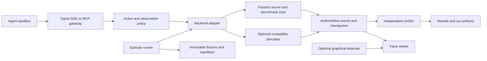

# Factorio-Bench environment design

**Status: proposed design, 3 October 2026.** Intended readers: contributors building or evaluating Factorio-Bench. No runtime, game integration, simulator, or benchmark results have been implemented in this repository. Requirements below describe acceptance targets, not capabilities already delivered.

[Project overview](../README.md) · [Documentation index](README.md) · [Contributing](../CONTRIBUTING.md)

Factorio-Bench will measure how well an AI agent learns, plans, builds, troubleshoots, and operates a factory over long horizons. The agent will interact with a running game through a documented interface; the benchmark will reset the world, enforce the task rules, measure authoritative outcomes, and preserve enough evidence to inspect a run.

The recommended first backend is **real Factorio**. It supplies the actual simulation and content, which is the most direct way to meet the requirement for exact mechanics. A second backend, built from scratch, will use the same benchmark interface and a separate compatibility program. It will become eligible for particular tasks as it passes comparison tests against the real game. Simulator acceptance requires measured mechanical compatibility in addition to the shared API.

The complete proposed target includes the base game and Space Age, with separate content profiles and a phased rollout. The first implementation milestone covers a small factory task; full gameplay coverage remains the long-term acceptance target.

## Design at a glance

| Decision | Reason | Evidence required before release |
| --- | --- | --- |
| Begin with real Factorio | Establish the mechanics reference before building another engine | Pinned executable and content, repeatable reset, and validated player actions |
| Separate player, assisted, and visual tracks | Observation and control privileges change the difficulty of a task | Explicit track policies and checks against unintended information or actions |
| Start with one automated factory task | A narrow task exposes control, timing, and scoring problems together | Scripted success, no-op failure, sustained output, and an independently recomputed verdict |
| Retain complete attempt records | Failures, retries, and exclusions affect comparisons | A declared attempt plan, classified failures, and provenance for every result |
| Qualify simulator tasks individually | Shared interfaces and similar outputs do not establish mechanical equivalence | Differential fixtures, interaction tests, and transfer to the native engine |

The [architecture](#architecture-and-trust-boundaries) defines responsibilities; the [implementation milestones](#implementation-milestones-and-acceptance) define when the environment is ready to evaluate agents. No benchmark ranking is proposed before the first five milestones pass.

### Terms

A **backend** is the engine integration that executes the world. A **content profile** pins the engine and enabled content. A **track** defines what an agent can observe and do, including assistance and clock rules. A **fixture** is an immutable starting world with a manifest; a **task** pairs it with instructions, limits, and a success criterion. An **attempt** is one execution of that task for an agent. **Conformance** means passing the declared behavior tests for an action or simulator feature; it is a bounded claim about the tested scope.

## Research basis

The following are source observations. The architecture and requirements in subsequent sections are proposals for Factorio-Bench.

| Reference | Observed pattern | Proposed use here |
| --- | --- | --- |
| [MapleBench](https://github.com/dmarzzz/maplebench) | A game adapter and narrow SDK connect agents to a server; the project separates authoritative outcomes and recording provenance from presentation. | Keep control, verification, and viewing separate. Capture comparable initial state and retain unsuccessful attempts. |
| [RuneBench](https://github.com/MaxBittker/RuneBench) | Generated tasks package instructions, an SDK environment, time budgets, and verifier logic for coding agents. | Generate versioned task bundles from one definition; offer an optional Harbor integration without making Harbor part of the game protocol. |
| [Factorio Learning Environment](https://github.com/JackHopkins/factorio-learning-environment) | An existing environment already evaluates agents in actual Factorio through generated Python programs and provides experiment tooling. | Study its documented behavior to inform our adapter requirements and conformance tests. Any source reuse requires a separate provenance and license review. |

These projects motivate the design; their scores are not comparable to Factorio-Bench scores. Upstream implementation details can differ from README summaries, so any adopted component must be locked to a reviewed revision.

The specific lessons are:

- MapleBench's [scorer](https://github.com/dmarzzz/maplebench/blob/59682f0abad6469713079ffa6807237949248e3f/scripts/full_client_score.py) checks baseline identity and native persistence evidence before accepting an outcome. Its [experiment coordinator](https://github.com/dmarzzz/maplebench/blob/59682f0abad6469713079ffa6807237949248e3f/scripts/full_client_experiment.py) retains a declared attempt plan and avoids replaying uncertain submissions. Factorio-Bench should bind each result to its fixture and final state and retain every planned attempt.
- RuneBench's [task generator](https://github.com/MaxBittker/RuneBench/blob/main/generate-tasks.ts) creates instructions, runtime configuration, and verifier files. Its [XP verifier](https://github.com/MaxBittker/RuneBench/blob/main/shared/check_skill_xp.ts) scores a best sampled rate, while its [gold verifier](https://github.com/MaxBittker/RuneBench/blob/main/shared/check_gold.ts) considers peak sampled and final saved holdings. Factorio-Bench should adopt the packaging pattern and define its own sustained-production objectives.
- FLE's inspected [movement](https://github.com/JackHopkins/factorio-learning-environment/blob/main/fle/env/tools/agent/move_to/server.lua) and [crafting](https://github.com/JackHopkins/factorio-learning-environment/blob/main/fle/env/tools/agent/craft_item/server.lua) tools include fast modes that perform scripted state changes with elapsed-time accounting. These semantics need a named FLE compatibility profile within the assisted engineering track. Reusing FLE does not by itself establish player-equivalent timing.

Research provenance: MapleBench was inspected at `59682f0abad6469713079ffa6807237949248e3f`; RuneBench and FLE source inspections used their moving `main` branches on the design date. A verified component lock is still required before implementation reuse. No upstream code has been copied into this repository. MapleBench's [license](https://github.com/dmarzzz/maplebench/blob/59682f0abad6469713079ffa6807237949248e3f/LICENSE), RuneBench's [stated license](https://github.com/MaxBittker/RuneBench#license), and FLE's [license](https://github.com/JackHopkins/factorio-learning-environment/blob/main/LICENSE) must be recorded separately for any components actually adopted.

## What must remain faithful

“All mechanics” needs a versioned definition. Each content profile must identify the exact executable, enabled official content, mod versions and hashes, runtime settings, and prototype data. Neither backend may silently change recipes, reach, crafting speed, research, resource costs, or enemy behavior to make an agent more successful.

The full target is the gameplay of a declared Factorio release, including interactions between systems. It does not mean compatibility with every third-party mod or with future Factorio releases. Graphical fidelity and keyboard/mouse control are additional requirements for the visual track. Editor and cheat capabilities are available only to fixture preparation, not to evaluated agents.

| System family | Coverage required before claiming full gameplay compatibility |
| --- | --- |
| World and character | Terrain, chunks, resource generation and depletion, collision, movement, inventory, reach, mining, hand crafting, health, equipment, death, and respawn |
| Items and production | Recipe availability and quantities, machine categories, crafting queues, modules, beacons, productivity, quality where enabled, and all relevant rounding and timing |
| Item transport | Belts, lanes, splitters, underground belts, inserter motion and pickup/drop rules, filters, stacks, containers, and backpressure |
| Fluids and energy | Pipes and fluid systems, temperature, machine connections, fuel, electricity distribution, steam, solar, accumulators, nuclear heat, and shortages |
| Research and automation | Science consumption, technology prerequisites and effects, labs, circuit signals and combinators, control conditions, and blueprint behavior |
| Rail and robots | Trains, signals, stations, schedules and interrupts, pathing, fuel, collisions, elevated rails where enabled, construction and logistics robots, networks, charging, and requests |
| Threats and environment | Pollution, enemy expansion and evolution, targeting and pathing, combat, ammunition, defenses, damage, repair, and environmental effects |
| Space Age | Planet-specific rules and resources, space platforms, travel, asteroids, cargo routing, spoilage, quality and recycling interactions, and expansion progression |
| Persistence and cooperation | Saves, loads, random state, multiple surfaces, forces and permissions, multiplayer actions, and interaction ordering |
| Player features | Configuration of supported entities, blueprint books, copy/paste, deconstruction and upgrade plans, map and remote interaction subject to the selected release's rules, vehicles and transport equipment |

This table is a coverage taxonomy, not an exhaustive assertion that every rule has been enumerated. Implementation must produce a registry of individual behaviors, including discovered edge cases. Every registered feature has a status, reference fixture, expected observations, and supported backend/profile. Untested and unsupported are visible statuses.

Native physics does not automatically make the agent interface faithful. A mod that creates an assembler for free still runs in Factorio, but it changes the task. The adapter must therefore pass its own action-conformance tests in addition to using the real engine.

Space Age content extends the required systems rather than merely changing the recipe list; its official overview describes the planets, platforms, and additional mechanics. The exact enabled official mods belong in each profile, including quality and elevated rails where selected. [Space Age content](https://www.factorio.com/game/content-space-age)

## Backend decision

| Property | Native Factorio backend | Simulator built from scratch |
| --- | --- | --- |
| Source of mechanics | Pinned Factorio executable and official content | Our independent implementation |
| Fidelity at the beginning | Native simulation; agent action semantics still need validation | Only behaviors covered by passing compatibility tests |
| Development priority | First; establishes benchmark validity and produces reference traces | Second; driven by demonstrated training, inspection, or scale needs |
| Potential benefit | Real game outcomes, existing content, native saves, multiplayer | More instrumentation and execution control; possible speed gains to measure |
| Main uncertainty | Safe player control, paused stepping, complete observation/recording support | Long tail of timing, numeric, pathfinding, and system interaction differences |
| Reporting | Native results grouped by exact configuration | Separate results labeled with compatibility level and engine revision |

Factorio's [official download page](https://factorio.com/download) offers a Linux headless server without graphics or audio and currently states that it includes Space Age content. Native rendering still requires a suitable graphical client. Provision the executable and assets outside this source repository; pin release checksums rather than following a moving download alias.

Use a Linux worker for repeatable runs; a Mac development machine can drive that worker through a VM or remote host. Record architecture and any emulation. Parallelism comes from independent worlds. Speed and memory targets remain measurements to establish in the first prototype, not claimed benefits of either backend.

The initial candidate release is **2.0.77**, identified as stable by the [official API index](https://lua-api.factorio.com/) on the design date. The same index points to 2.1.20 as experimental. Use the matching versioned API and actual downloaded executable hash; a link containing `latest` is not a reproducible dependency.

The initial native capability audit starts here. Documented APIs are implementation candidates; the acceptance column remains work to perform.

| Capability | Documented mechanism | Required prototype acceptance |
| --- | --- | --- |
| Dedicated simulation | A headless server loads a save and has no server character. [Multiplayer documentation](https://wiki.factorio.com/Multiplayer) | Provision a real player/character or prove an equivalent controller; configure empty-server pause deliberately. Test a run without an observer connected. |
| Private command transport | RCON configuration and Lua responses. [Command line](https://wiki.factorio.com/Command_line_parameters), [LuaRCON](https://lua-api.factorio.com/2.0.77/classes/LuaRCON.html) | Bind privately, authenticate within the trusted runtime, and accept only the benchmark's validated commands. |
| Bounded simulation | `tick_paused` and `ticks_to_run` control entity updates. [LuaGameScript](https://lua-api.factorio.com/2.0.77/classes/LuaGameScript.html) | Verify exact `game.tick` deltas, queue admission while paused, and observation boundaries. Do not budget with `ticks_played`, which can progress while paused. |
| Character activity | `walking_state`, `mining_state`, `shooting_state`, and `begin_crafting` expose control mechanisms. [LuaControl](https://lua-api.factorio.com/2.0.77/classes/LuaControl.html) | Refresh controls for the required ticks, verify duration and resource effects, and handle interruption or death. Immediate mining methods are not automatically equivalent to holding the mine input. |
| Item-backed placement | `can_build_from_cursor` and `build_from_cursor` expose player construction behavior. [LuaPlayer](https://lua-api.factorio.com/2.0.77/classes/LuaPlayer.html) | Validate cursor inventory, reach, collision, events, and consumption. Audit any fallback that directly creates entities. |
| Native frames | `take_screenshot` does nothing in headless mode. [LuaGameScript](https://lua-api.factorio.com/2.0.77/classes/LuaGameScript.html) | Use a graphical observer/client with matching content, synchronize frames to ticks, and ensure it cannot change the task state. |

## Architecture and trust boundaries

This section describes proposed component responsibilities and public evaluation boundaries. Live deployment topology, private endpoints, operator accounts, and held-out evaluation material belong outside this repository, as specified in [the sharing policy](data-sharing.md#public-architecture-and-private-operations). Implementation follows [the independent development policy](../THIRD_PARTY.md#independent-implementation).



The agent writes ordinary code and calls the SDK. Its container has a writable scratch directory and only the gateway capability needed for its current episode. A typed MCP interface and a code-execution tool may wrap the same SDK; both must reach the same validators and budgets. SDK helpers may format observations and repeat explicit calls. Helpers that choose routes, layouts, or production strategies count as assistance and belong to a separately named track.

The runner owns startup, reset, snapshot selection, the simulation clock, quotas, and lifecycle transitions. The native adapter owns a benchmark mod and its private control channel. RCON is a runner-to-server transport, never an agent-facing arbitrary-command endpoint. Agents cannot access Lua console execution, save files, the Docker socket, server ports, verifier storage, task secrets, or mutation APIs used to prepare fixtures.

The verifier reads authoritative evidence through an independent channel and recomputes outcomes. A successful tool return, an agent's claim of completion, or a dashboard number is not evidence that the objective was achieved. Privileged fixture changes are allowed only before the scored start or as a predeclared task disturbance, and appear in the event record.

The viewer provides a factory map, production and power charts, action timeline, milestone markers, failure messages, and an optional synchronized native recording. Full-state views are available to evaluators after a run. Agent-facing visual observations must retain the track's visibility restrictions.

Recommended initial stack: TypeScript for contracts, runner, SDK, MCP gateway, and viewer; Lua for the native benchmark mod. A Python client can expose the same wire protocol for agent frameworks and FLE experiments. Use JSONL for event streams and JSON for manifests and scores; defer a database until indexing many runs warrants one. Choose a simulator implementation language after the first compatibility prototype and profiling, rather than committing to an engine stack now.

## Agent tracks and control contract

Separate tracks answer different research questions. Results are comparable only within the same observation, action, assistance, and clock profile.

| Track | Agent receives | Agent may do | Primary question |
| --- | --- | --- | --- |
| Structured player | Bounded observations from an embodied character and legitimately discovered world | Validated player-equivalent actions | Can the agent plan and operate a factory with explicit tools? |
| Structured engineering | Declared broader state and explicitly documented construction/navigation assistance | The assistance listed in the task manifest | How well can the agent solve production and layout problems with abstraction? |
| Visual player | Client images and allowed interface feedback | Keyboard/mouse input through a graphical client | Can the agent operate the game's interface and interpret its visuals? |

Start with structured player. Add the engineering track for useful integrations whose behavior differs from ordinary player control; retain those differences in the results. Add visual player after native frame capture and input recording are reliable.

An observation includes episode ID, monotonic sequence, simulation tick, selected surface, character state, permitted inventory and recipes, visible entities and networks, and recent action outcomes. It must distinguish unknown, absent, and hidden. Queries have bounded radius, pagination, byte limits, and stable entity handles. Production statistics must not leak a hidden factory, force, or surface. Track-specific map knowledge is preserved across visits and cannot be expanded by querying arbitrary coordinates.

The proposed action families are:

| Family | Examples | Required enforcement |
| --- | --- | --- |
| Character | Walk for a bounded interval, mine, hand craft, equip, shoot, wait | Movement, collision, reach, duration, inventory, ammunition, and research rules |
| Construction | Place, rotate, remove, repair, transfer items | Native placement validity, item cost, reach or allowed remote mechanism, and actual completion |
| Configuration | Set recipe/filter, connect circuit wire, configure combinator, queue research | Entity access, tool/item requirements where applicable, unlocked features, and valid parameters |
| Advanced logistics | Configure trains, robot requests, blueprint/upgrade/deconstruction orders | Real entities and networks perform the work; no free construction or instant delivery |
| Expansion | Configure platforms, cargo requests, and planet-specific machinery | Same profile's progression, travel, inventory, and surface rules |

Each operation must be mapped to a verified mechanism in the selected game version. Where a public Lua method bypasses normal input rules, the adapter needs equivalent checks and conformance tests. If equivalence cannot be established, use client input or mark that action as assisted. Reject unsupported operations explicitly; never silently substitute teleportation, item creation, instant mining, or instant crafting.

Commands carry `episode_id`, `request_id`, `expected_observation_seq`, `action`, `arguments`, and `max_ticks`. Receipts report accepted/rejected, a stable action ID, start/end ticks, status, failure reason, and costs actually incurred. Distinguish admission from execution and completion. Bounded actions may end partially completed; partial item transfers report the transferred count. Rejected requests cannot consume game resources but still count against request budgets.

The gateway orders admission and mutation transactions per player; the runner orders cross-player transactions deterministically. This does not serialize native background activities: crafting, walking, and machine operation may overlap where the game allows it. Held controls use explicit input channels, and each action declares conflicting channels and interruption behavior. Receipts distinguish an accepted command from the later completion of its activity. `max_ticks` bounds a requested observation/advance interval; it does not accelerate or suspend queued crafting.

Retrying a request with the same ID returns its recorded outcome without executing again. The deduplication record is tied to the authoritative action sequence/checkpoint. A gateway crash between dispatch and acknowledgement triggers reconciliation; if execution cannot be established, mark the attempt interrupted and rerun from its fixture under the retry policy. Do not promise exactly-once execution merely by caching HTTP responses.

## Time and episode lifecycle

Use separate clocks for simulation progress, agent inference/tool latency, and end-to-end wall time. A request that advances 600 simulation ticks has a defined game cost regardless of how quickly the host can process it. Record actual engine updates, not just requested speed or elapsed wall time.

The initial planning track should freeze entity updates while the model thinks and advance a bounded number of ticks for admitted actions and explicit waits. Actions must have nonzero native costs where gameplay requires them. Waiting advances every relevant system, including enemies and spoilage, rather than only the machine the agent cares about. Cap simulation ticks, requests, decisions, token usage where available, and agent wall time independently.

Also pin an action-cadence policy. For the initial structured-player profile, propose at most one instantaneous mutation transaction per player per simulation tick, with at least one entity update between successive transactions. Commands that set sustained input states use separately declared compatible channels; a batch expands into individually charged transactions. Reads do not advance the world but consume request and observation budgets. This is an explicit interface convention to validate, not a claim that every native input device has this cadence. No unlimited sequence of free placements or inventory transfers may accumulate while physics is paused.

A later real-time track lets the world run during inference. Publish its target update rate and actual rate, slowdowns, tool latency, and inference time. Do not combine its rankings with paused planning runs. The visual track requires its own validated clock/input arrangement.

Bounded stepping is an implementation gate. The mod/control channel must admit commands and read state while paused, advance the intended number of entity updates, and return a coherent observation. Script activity and player/controller behavior while paused must be tested. If this cannot be guaranteed on the pinned build, launch a clearly labeled real-time prototype first and keep the paused track unavailable.

An episode follows these transitions:

1. **Prepare:** Resolve the task, engine, content, bridge, observation policy, agent configuration, and all hashes. Allocate an isolated process, world directory, and private ports.
2. **Restore:** Copy an immutable start save. A seed alone is insufficient. Check settings, inventories, technologies, world state, and the task-specific initial-state fingerprint before exposing the episode.
3. **Run:** Start the clocks and append ordered commands, outcomes, observations, and authoritative events. Check budgets outside the agent process.
4. **Freeze:** Apply the task's termination policy and establish one final simulation tick. For fixed-horizon tasks, a completion request ends agent control and triggers no-input continuation to the original cutoff. It does not shorten the scoring window. A separate runner watchdog bounds this continuation. Drain only events through the declared boundary.
5. **Verify:** Compute task metrics and reconcile the event totals with independent final-state checks. Write completion, timeout, agent error, or infrastructure failure as distinct outcomes.
6. **Archive:** Save the final world, checkpoints, manifests, trace, verifier receipt, and recording status. Close the worker and release its resources.

Resuming a checkpoint requires matching world state, bridge state, event sequence, budgets, and agent state. Otherwise create a new attempt from the original fixture. Keep every attempt and the reason for any exclusion. Avoid API-call replay on an uncertain resume.

## Task suite and outcome metrics

Use paired fixtures across agents: identical start saves, explicit information access, and the same resource/time limits. For planning tasks, provide the same pinned recipe and control documentation; decide whether blueprint libraries and internet access are allowed before evaluation. Research measures agent behavior under that policy, not an undefined mix of outside assistance.

| Task family | Representative objective | Primary measurement | Generalization variant |
| --- | --- | --- | --- |
| Bootstrap | Build a mining, smelting, power, and delivery chain | Sustained verified delivery by the deadline | Ore placement, terrain, starting equipment |
| Production | Maintain declared science consumption across a window | Integrated qualifying consumption and sustained rate | Recipe chain and resource constraints |
| Diagnosis | Restore a damaged or stalled factory | Recovery time plus output after recovery | Broken power, wrong filters, jams, depleted inputs |
| Optimization | Improve a supplied factory under a material budget | Additional useful output over a fixed horizon | Different bottlenecks and constrained footprints |
| Rail and logistics | Supply several consumers with variable demand | Delivered demand fraction, starvation, and deadlock events | Network geometry and demand schedule |
| Circuits | Build a controller meeting stated operating conditions | Fraction of declared test conditions satisfied | Different thresholds and disturbance timing |
| Survival | Keep production operating through attacks | Objective completion, uptime, and losses | Threat direction and resource pressure |
| Long horizon | Progress from a declared start to a specified rocket outcome | Success, completion tick, and milestone vector | New maps and limited initial supplies |
| Space Age | Establish a declared interplanetary supply chain | Qualified cargo delivery and continued operation | Planet mix, travel, spoilage, and quality constraints |
| Cooperation | Several agents build and maintain one factory | Shared objective plus communication and resource cost | Role assignment and communication topology |

A task must specify its terminal event, not merely say “launch a rocket” or “produce science.” Examples include consuming a named science pack in labs, delivering cargo to a designated destination, or reaching a particular research milestone. Give objective rules to the agent; hold out instance details or seeds for generalization without hiding the basic success criterion.

Prefer sustained useful output over a brief peak. For a target sink, count each accepted unit once at the declared boundary and prevent later removal/reinsertion from earning credit. Track consumption or delivery events; inventory snapshots alone can miss activity between samples. If a benchmark sink destroys delivered items, identify that addition as part of the task and disclose its effect on the economy. Use normal downstream consumption when the task should preserve the native economy.

The initial bootstrap task has a construction phase through tick 54,000, followed by 18,000 ticks of hands-off verification. Ticks are relative to the scored start. In each fixed window `[54,000 + 3,600i, 57,600 + 3,600i)` for `i = 0…4`, require at least 30 iron ore newly extracted by powered electric drills, 30 iron plates newly smelted by the player's furnaces, and 30 iron plates automatically delivered into the designated output sink. The verifier also checks that the qualifying drills received electrical energy from the player's network. These conditions verify ongoing mining, smelting, power, and delivery instead of counting manually carried plates alone.

At tick 54,000 the runner clears held character inputs and queued agent mutation commands and makes agent access read-only; the factory continues normally. The sink counts only new native inserter deliveries during the verification interval and consumes them once. Agent transfers into the sink are prohibited throughout the task. Any plates delivered before verification are consumed without score, so they cannot be re-counted. Observe the sink at a fixed tick stage and cross-check its ledger against inventories and production counters; instrumentation accuracy is an acceptance gate. No plates are present in the initial fixture, and the destination, starting kit, resource access, and map are frozen after baseline calibration.

The five windows are fixed even if the agent voluntarily finishes earlier. The world then continues without agent input to tick 72,000. A verdict requires the full verification interval; early stops cannot redefine “final.” At the nominal 60 updates per game second this is five one-minute windows within a twenty-minute game horizon. These are proposed calibration targets, not demonstrated achievable results.

The harness computes each delivery rate as `accepted_delta * ticks_per_game_minute / window_ticks`. It reports total accepted output, the minimum window rate, the extraction and smelting counters, power evidence, and success only if every required condition passes in every window. Native buffers remain legal; the task establishes operation across the declared horizon, not indefinite sustainability. A longer continuation check must be specified before evaluation if it affects the score.

Use task success and the task's stated outcome metric as primary results. Report game time, requests, tokens, API cost when available, latency, material usage, and power consumption separately. Do not collapse these into an uncalibrated universal “intelligence score.” For a suite summary, publish an equal-weight mean of per-task success rates alongside the task vector and missing-run counts; any alternative weighting must be declared in advance.

## Example task contract

This JSON illustrates the proposed schema; it is not runnable configuration. Fixture and component locks must resolve to concrete hashes before a runner will accept it.

```json
{
  "schema_version": "factorio-bench.task.v1",
  "task_id": "bootstrap-iron-v1",
  "backend": "factorio-native",
  "content_profile": "base-2.x",
  "engine_lock": "locks/native-base-v1.json",
  "fixture": "fixtures/bootstrap-iron-v1/manifest.json",
  "track": "structured-player",
  "clock": {
    "mode": "bounded-step",
    "simulation_tick_budget": 72000,
    "agent_wall_seconds": 1800,
    "max_action_ticks": 600,
    "action_cadence_profile": "one-mutation-per-tick-v1"
  },
  "limits": {
    "decisions": 2000,
    "requests": 10000,
    "observation_bytes": 65536
  },
  "objective": {
    "metric": "accepted-item-count",
    "item": "iron-plate",
    "sink": "task-output",
    "window_ticks": 3600,
    "window_count": 5,
    "minimum_per_window": 30,
    "evaluation_start_tick": 54000,
    "evaluation_end_tick": 72000,
    "hands_off": true,
    "required_per_window": {
      "electric_drill_iron_ore": 30,
      "furnace_iron_plate": 30,
      "qualifying_drill_energy_joules_greater_than": 0
    }
  },
  "termination_policy": "fixed-horizon-with-voluntary-handoff",
  "documentation_profile": "recipes-and-sdk-v1",
  "external_network": false,
  "verifier_version": "bootstrap-iron-v1"
}
```

The referenced engine lock contains exact engine version and SHA-256, enabled official content/mod versions and hashes, bridge revision, runtime settings, and observation/action schema versions. The fixture manifest contains the start-save hash, map settings and seed, preparation script version, inventory and technology checks, sink behavior, and initial-state fingerprint. Tokens and inference settings belong in the associated experiment manifest, with an explicit policy for providers that do not expose token counts.

## Repetition and trustworthy comparisons

Run a no-op agent, a scripted reference policy, and a simple heuristic first. A human baseline is useful only under a comparable interface and clock, or clearly labeled as a different track. Baselines establish solvability, scorer behavior, and variance; they do not replace agent trials.

For an initial comparison, propose at least five independent fixtures per task and three agent trials per fixture, then increase sample sizes if uncertainty prevents a useful conclusion. These are starting design targets. Pair agents on fixtures, randomize or balance execution order, and hold worker resource allocations constant. Pin model identity, client/framework revision, prompts, inference settings, context policy, SDK version, and documentation snapshot.

Keep public development fixtures separate from held-out evaluation fixtures. Record task exposure and permitted planning artifacts. Prevent scratch directories and factory state from leaking across trials unless persistent learning is itself the declared experiment.

Report per-task outcomes, distribution of costs and completion times, and uncertainty intervals. For suite estimates, account for clustering by fixture rather than treating repeated trials on one save as independent maps. Keep crashes and missing runs visible; do not silently replace them with favorable retries. Publish both the planned attempt count and the valid count, plus the predefined infrastructure-retry policy. An incomplete plan receives no unqualified ranking.

Agent crashes and exhaustion of agent wall-time, request, decision, or token budgets before normal handoff count as scored task failures. Reaching the scheduled simulation cutoff is normal termination and invokes the task verifier. Voluntary handoff is allowed and follows the declared continuation policy. Only failures classified in advance as infrastructure-invalid may be excluded from the conditional gameplay-success denominator; show their count and overall run-completion rate separately. A replacement is a new attempt, and all consumed tokens, cost, and wall time from the interrupted attempt remain in operational totals. Fix retry eligibility and maximum retries before running; retry decisions must not depend on how promising the observed score was.

## Evidence, playback, and secrets

Each run should produce the following private artifact set. Its retention and any public export follow the [data-sharing policy](data-sharing.md):

```text
run/
  manifest.json
  initial-state.json
  observations.jsonl
  commands.jsonl
  actions.jsonl
  events.jsonl
  checkpoints/
  final-save.zip
  metrics.json
  verdict.json
  recording-manifest.json
  hashes.json
```

The manifest records provenance and settings, not credentials. The recording manifest distinguishes native client footage, a state-derived viewer, and a synthetic illustration. Native footage needs frame timestamps, corresponding simulation ticks, dimensions, dropped-frame accounting, and observer configuration. A headless trace renderer is useful for inspection but must not be presented as footage of the game client.

Replay has three meanings: playing recorded media, reconstructing a viewer from events, and re-executing actions in an engine. Label which is available. Test re-execution from the same fixture against checkpoints before claiming reproducibility. A canonical state digest must declare which fields it covers; equal digests of selected fields are not proof that every hidden engine variable is equal. Pair state comparisons with forward behavior checks and preserve native saves.

Model credentials remain in an approved local credential store or an authorized process outside the agent sandbox. The runner passes credential references where possible and allows only authorized local processes to consume secret values. Filter logs before they reach transcripts, reports, or recordings. Do not put passwords, tokens, authentication headers, credential files, or secret-bearing environment dumps in the evidence bundle. RCON credentials stay private to the adapter. Exported agent logs are checked before publication; no artifacts are published automatically by this design. A scanner is an additional check, not permission to publish raw evidence. Follow [SECURITY.md](../SECURITY.md) if sensitive material is exposed.

## Building a compatible simulator

Treat the simulator as a distinct engineering project with a shared benchmark contract. Its purpose would be faster experiments, inspectable internals, and deployment flexibility. The native backend remains the reference for mechanics and transfer testing. Do not import proprietary source or ship extracted game assets in this repository; an independently implemented renderer can use original visuals.

A possible architecture is a deterministic tick loop with explicit random streams, spatial indexing, item and fluid networks, production and energy systems, entity state, and serialization. Public behavior descriptions and observations of authorized native runs guide the implementation. Matching names or recipes is only one part of compatibility; scheduling, numerical precision, collision, buffering, and ordering can change strategies.

Build it in gates:

1. **Contract emulator:** Implement a tiny deterministic world to test reset, command admission, clocks, evidence, and verification. Label it a harness test double; exclude it from gameplay rankings.
2. **Early factory compatibility:** Implement the minimum native feature set needed by bootstrap fixtures, including character costs, mining, smelting, belts, inserters, fuel, and power as required by those fixtures. Add save/load tests.
3. **Production and control:** Add the research graph, advanced recipes, fluid systems, modules/beacons, circuits, and construction/logistics robots, with tests for cross-system interactions.
4. **Transport and threats:** Add rail behavior, combat, pollution, enemy behavior, map generation, and larger-world performance. Cover interactions with earlier gates.
5. **Expansion and cooperation:** Add all declared Space Age behavior, multiple surfaces, forces, and cooperative execution. Finish remaining base-game features identified by the registry.
6. **Release compatibility review:** Audit the declared release's entire feature registry, unsupported actions, UI requirements if applicable, and regression corpus. Publish scope, exceptions, and remaining uncertainty.

For each gate, load equivalent fixtures in both engines, apply the same allowed action trace, and compare receipts, event times, inventory/recipe changes, positions, signals, network outputs, and terminal outcomes. Stable logical IDs replace engine-specific object IDs. Exact counters and event order require exact matches; floating quantities need a justified, published tolerance with tests showing that it does not change decisions or scores.

Use hand-authored edge cases, generated legal action sequences, conservation invariants, save/load continuation tests, and traces from real agents. Preserve every minimized divergence as a regression test. Maintain separate hold-out conformance fixtures to reduce overfitting to the development corpus. Differential coverage, tested task coverage, and native transfer performance are separate report fields.

Engine states do not need binary-compatible save files, but the task-relevant behavior must match. If map generation differs, imported canonical fixture maps can support a restricted compatibility tier; they cannot support a claim of native map-generation parity. Likewise, a compatible SDK does not establish native UI or multiplayer protocol compatibility.

Never mix simulator and native scores into one undifferentiated leaderboard. Promote a simulator-backed task only when its required features and interaction tests pass and held-out agent traces transfer. Passing a finite test corpus supports a bounded compatibility claim, not proof of exact equivalence across every possible Factorio world.

## Implementation milestones and acceptance

| Milestone | Deliverable | Exit evidence |
| --- | --- | --- |
| 0. Resolve integration | Pin a native release; study relevant public environment behavior and the required player actions; choose an initial fixture | A documented capability matrix and a worker boot/reset smoke test |
| 1. Establish control | Implement the benchmark mod, gateway, receipts, visibility policy, and bounded stepping | Native action costs demonstrated; no free placement or hidden-state access; pause behavior validated |
| 2. Complete one task | Bootstrap fixture, SDK, event log, independent verifier, scripted baseline | End-to-end success and no-op failure; score recomputed from retained evidence; final state reconciled |
| 3. Establish repeatability | Immutable fixtures, checkpoint/resume policy, worker isolation, experiment manifest | Ten reset checks with matching declared start fingerprints; deterministic scripted reruns; interruption cases explained |
| 4. Enable evaluation | Agent adapters, budget enforcement, held-out fixtures, trace viewer and native observer | Repeated pilot with visible failures and complete evidence; recording provenance verified |
| 5. Broaden native coverage | Production, diagnosis, logistics, long-horizon, expansion, and cooperation tasks | Per-family baselines and action-conformance acceptance; feature registry updated |
| 6. Evaluate simulation | Implement the first useful simulator compatibility gate | Differential report, measured execution costs, and native transfer report; separate result label |

A runnable first release requires milestones 0–4. It can be honestly useful before it covers every advanced gameplay family. A full-feature claim requires completion of the declared profile's registry and documented limitations. No elapsed-time estimate for a complete simulator is credible until the first compatibility gate has exposed the size of the gap.

Before ranking agents, verify meaningful failure cases: duplicate dispatch, lost acknowledgements, stale observations, resource/reach violations, hidden-state requests, action timeout, an agent crash, a server crash, tampered score files, fixture mismatch, sink double-counting, and replay divergence. Scorer checks must include independent expected outcomes, not only code paths that reproduce the scorer's implementation.

The first practical build should establish whether a real agent can turn a fixed native starting state into an operating, automated iron-plate factory, under player-equivalent rules, with a reproducible and independently verified record. Once that works, broader tasks reuse the same evidence and control system.
